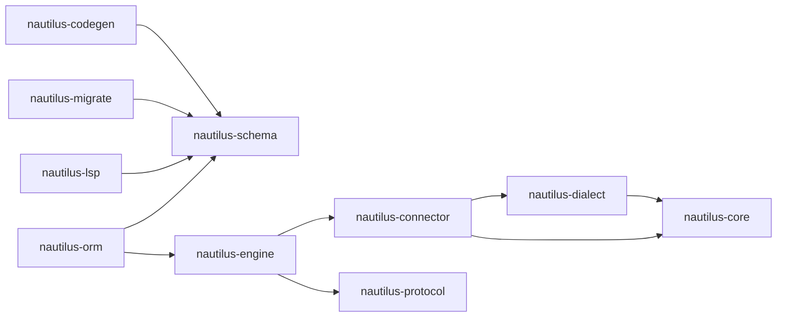

# Nautilus

[](https://github.com/y0gm4/nautilus/actions/workflows/ci.yml)

Nautilus is a schema-first ORM toolkit built around a Rust query engine.

This repository currently includes:

- a `.nautilus` schema language
- generators for Rust, Python, and JavaScript/TypeScript clients
- a `nautilus` CLI for validate/format/generate/db/migrate workflows plus Studio app management
- a JSON-RPC engine over stdin/stdout
- an LSP server and a VS Code extension
- PostgreSQL, MySQL, and SQLite support

## Workspace map

| Component | Role |
| --- | --- |
| [crates/nautilus-cli](crates/nautilus-cli/README.md) | `nautilus` CLI (`generate`, `validate`, `format`, `db`, `migrate`, `engine`, `python`, `studio`) |
| [crates/nautilus-schema](crates/nautilus-schema/README.md) | Lexer, parser, validator, formatter, editor analysis for `.nautilus` |
| [crates/nautilus-codegen](crates/nautilus-codegen/README.md) | Rust / Python / JS client generation |
| [crates/nautilus-engine](crates/nautilus-engine/README.md) | JSON-RPC engine runtime |
| [crates/nautilus-protocol](crates/nautilus-protocol/README.md) | Wire-format types and method contracts |
| [crates/nautilus-core](crates/nautilus-core/README.md) | Query AST, expressions, typed columns, values |
| [crates/nautilus-dialect](crates/nautilus-dialect/README.md) | SQL rendering for Postgres / MySQL / SQLite |
| [crates/nautilus-connector](crates/nautilus-connector/README.md) | sqlx-backed executors and connector client |
| [crates/nautilus-migrate](crates/nautilus-migrate/README.md) | Schema diffing, DDL generation, migration execution |
| [crates/nautilus-lsp](crates/nautilus-lsp/README.md) | LSP server for schema files |
| [tools/vscode-nautilus-schema](tools/vscode-nautilus-schema/README.md) | VS Code extension wiring syntax + LSP |

### Dependency graph



## Installation

### Python

```bash
pip install nautilus-orm
```

### JavaScript / TypeScript

```bash
npm install @y0gm4/nautilus-orm
```

### Rust

```bash
cargo install nautilus-orm
```

### CLI (all platforms)

```bash
# macOS / Linux
curl --proto '=https' --tlsv1.2 -LsSf https://github.com/y0gm4/nautilus/releases/latest/download/nautilus-orm-installer.sh | sh

# Windows
powershell -ExecutionPolicy ByPass -c "irm https://github.com/y0gm4/nautilus/releases/latest/download/nautilus-orm-installer.ps1 | iex"
```


## Define your schema

Create a file `*.nautilus` and define your schema such as:

```prisma
datasource db {
  provider = "postgresql"
  url      = env("DATABASE_URL")
}

generator client {
  provider = "nautilus-client-py"  // or "nautilus-client-rs", "nautilus-client-js"
  output   = "db"
}

enum Role {
  USER
  ADMIN
  MODERATOR
}

enum OrderStatus {
  PENDING
  CONFIRMED
  SHIPPED
  DELIVERED
  CANCELLED
}

type Address {
  street  String
  city    String
  zip     String
  country String
}

model User {
  id        Uuid        @id @default(uuid())
  email     String      @unique
  username  VarChar(30) @unique
  name      String
  role      Role        @default(USER)
  bio       String?
  tags      String[]
  address   Address?
  createdAt DateTime    @default(now()) @map("created_at")
  updatedAt DateTime    @updatedAt @map("updated_at")
  profile   Profile?
  orders    Order[]

  @@index([email], type: Hash)
  @@index([createdAt], type: Brin, map: "idx_users_created")
  @@map("users")
}

model Profile {
  id      Int           @id @default(autoincrement())
  userId  Uuid          @unique @map("user_id")
  avatar  String?
  website VarChar(255)?
  user    User          @relation(fields: [userId], references: [id], onDelete: Cascade)

  @@map("profiles")
}

model Product {
  id          BigInt         @id @default(autoincrement())
  name        String
  slug        VarChar(100)   @unique
  description String?
  price       Decimal(10, 2) @check(price > 0)
  discount    Decimal(5, 2)  @default(0)
  finalPrice  Decimal(10, 2) @computed(price - discount, Stored) @map("final_price")
  stock       Int            @default(0) @check(stock >= 0)
  tags        String[]
  metadata    Json?
  active      Boolean        @default(true)
  createdAt   DateTime       @default(now()) @map("created_at")
  updatedAt   DateTime       @updatedAt @map("updated_at")
  orderItems  OrderItem[]

  @@index([tags], type: Gin)
  @@index([name, slug])
  @@map("products")
}

model Order {
  id          BigInt         @id @default(autoincrement())
  userId      Uuid           @map("user_id")
  status      OrderStatus    @default(PENDING)
  totalAmount Decimal(12, 2) @map("total_amount")
  note        String?
  createdAt   DateTime       @default(now()) @map("created_at")
  updatedAt   DateTime       @updatedAt @map("updated_at")
  user        User           @relation(fields: [userId], references: [id], onDelete: Restrict)
  items       OrderItem[]

  @@check(totalAmount > 0)
  @@index([userId, status])
  @@index([createdAt], type: Brin, map: "idx_orders_created")
  @@map("orders")
}

model OrderItem {
  id        BigInt         @id @default(autoincrement())
  orderId   BigInt         @map("order_id")
  productId BigInt         @map("product_id")
  quantity  Int            @check(quantity > 0)
  unitPrice Decimal(10, 2) @map("unit_price")
  lineTotal Decimal(12, 2) @computed(quantity * unitPrice, Stored) @map("line_total")
  order     Order          @relation(fields: [orderId], references: [id], onDelete: Cascade)
  product   Product        @relation(fields: [productId], references: [id], onDelete: Restrict)

  @@unique([orderId, productId])
  @@map("order_items")
}
```

Then validate, push, and generate:

```bash
nautilus validate --schema schema.nautilus
nautilus db push --schema schema.nautilus
nautilus generate --schema schema.nautilus
```

`nautilus db push` regenerates the client automatically unless you pass `--no-generate`.
If `--schema` is omitted, schema-based commands auto-detect the first
`.nautilus` file in the current directory.

Generated clients are local build artifacts, not registry packages. If your
schema uses `output = "./db"`, the normal consumption path is to import that
directory directly, for example `from db import Nautilus` in Python or
`import { Nautilus } from "./db/index.js"` in JavaScript.

## Usage Examples

### CRUD Operations

#### Python

**Async context manager**:

```python
import asyncio
from db import Nautilus

async def main():
    async with Nautilus() as client:
        # Create a user with enum, array, and composite type
        user = await client.user.create({
            "email": "alice@example.com",
            "username": "alice",
            "name": "Alice Smith",
            "role": "ADMIN",
            "tags": ["vip", "early-adopter"],
            "address": {
                "street": "123 Main St",
                "city": "Portland",
                "zip": "97201",
                "country": "US",
            },
        })

        # Find unique by @unique field
        found = await client.user.find_unique(where={"email": "alice@example.com"})

        # Find many with enum filter
        admins = await client.user.find_many(where={"role": "ADMIN"})

        # Update — updatedAt is set automatically
        updated = await client.user.update(
            where={"email": "alice@example.com"},
            data={"role": "MODERATOR", "bio": "Hello world"},
        )

        # Create a product — finalPrice is computed automatically
        product = await client.product.create({
            "name": "Mechanical Keyboard",
            "slug": "mechanical-keyboard",
            "price": 149.99,
            "discount": 20.00,
            # finalPrice = 129.99 (computed: price - discount)
            "stock": 50,
            "tags": ["electronics", "peripherals"],
            "metadata": {"weight_kg": 0.8, "color": "black"},
        })

        # Delete
        await client.user.delete(where={"email": "alice@example.com"})

asyncio.run(main())
```

**Manual connect / disconnect:**

```python
client = Nautilus()
await client.connect()

user = await client.user.create({
    "email": "alice@example.com",
    "username": "alice",
    "name": "Alice Smith",
})

await client.disconnect()
```

**Auto-register — call operations directly from model classes:**

```python
from db import Nautilus, User, Product

async with Nautilus(auto_register=True) as client:
    # No need to go through `client.user` — use User.nautilus directly
    user     = await User.nautilus.create({"email": "alice@example.com", "username": "alice", "name": "Alice Smith"})
    admins   = await User.nautilus.find_many(where={"role": "ADMIN"})
    products = await Product.nautilus.find_many(where={"active": True})
```

#### JavaScript / TypeScript

```typescript
import { Nautilus } from './db/client';

async function main() {
    const client = new Nautilus();
    await client.connect();

    // Create with enum, array, and composite type
    const user = await client.user.create({
        data: {
            email: 'alice@example.com',
            username: 'alice',
            name: 'Alice Smith',
            role: 'ADMIN',
            tags: ['vip', 'early-adopter'],
            address: {
                street: '123 Main St',
                city: 'Portland',
                zip: '97201',
                country: 'US',
            },
        },
    });

    // Find unique
    const found = await client.user.findUnique({
        where: { email: 'alice@example.com' },
    });

    // Find many with enum filter
    const admins = await client.user.findMany({
        where: { role: 'ADMIN' },
    });

    // Update — updatedAt is set automatically
    const updated = await client.user.update({
        where: { email: 'alice@example.com' },
        data: { role: 'MODERATOR', bio: 'Hello world' },
    });

    // Create a product — finalPrice is computed automatically
    const product = await client.product.create({
        data: {
            name: 'Mechanical Keyboard',
            slug: 'mechanical-keyboard',
            price: 149.99,
            discount: 20.0,
            stock: 50,
            tags: ['electronics', 'peripherals'],
            metadata: { weight_kg: 0.8, color: 'black' },
        },
    });

    // Delete
    await client.user.delete({
        where: { email: 'alice@example.com' },
    });

    await client.disconnect();
}

main();
```

#### Rust

Assume `provider = "nautilus-client-rs"` and `interface = "async"` in the generator block.

```rust
use db::{
    Address, Client, Product, ProductCreateInput, Role, User, UserCreateInput, UserDeleteArgs,
    UserUpdateArgs, UserUpdateInput,
};
use nautilus_core::{FindManyArgs, FindUniqueArgs, IncludeRelation};

#[tokio::main]
async fn main() -> anyhow::Result<()> {
    let client = Client::postgres(&std::env::var("DATABASE_URL")?).await?;

    // Create with enum, array, and composite type
    let user = User::nautilus(&client)
        .create(UserCreateInput {
            email: Some("alice@example.com".into()),
            username: Some("alice".into()),
            name: Some("Alice Smith".into()),
            role: Some(Role::Admin),
            tags: Some(vec!["vip".into(), "early-adopter".into()]),
            address: Some(Some(Address {
                street: "123 Main St".into(),
                city: "Portland".into(),
                zip: "97201".into(),
                country: "US".into(),
            })),
            ..Default::default()
        })
        .await?;

    // Find unique with eager-loaded relations
    let found = User::nautilus(&client)
        .find_unique(
            FindUniqueArgs::new(User::email().eq("alice@example.com"))
                .with_include("orders", IncludeRelation::plain()),
        )
        .await?;

    // Find many with enum filter
    let admins = User::nautilus(&client)
        .find_many(FindManyArgs {
            where_: Some(User::role().eq(Role::Admin)),
            ..Default::default()
        })
        .await?;

    // Update — updatedAt is set automatically
    let updated = User::nautilus(&client)
        .update(UserUpdateArgs {
            where_: Some(User::email().eq("alice@example.com")),
            data: UserUpdateInput {
                role: Some(Role::Moderator),
                bio: Some(Some("Hello world".into())),
                ..Default::default()
            },
        })
        .await?;

    // Create a product — finalPrice is computed automatically
    let product = Product::nautilus(&client)
        .create(ProductCreateInput {
            name: Some("Mechanical Keyboard".into()),
            slug: Some("mechanical-keyboard".into()),
            price: Some(rust_decimal::Decimal::new(14999, 2)),
            discount: Some(rust_decimal::Decimal::new(2000, 2)),
            stock: Some(50),
            tags: Some(vec!["electronics".into(), "peripherals".into()]),
            metadata: Some(Some(serde_json::json!({
                "weight_kg": 0.8,
                "color": "black"
            }))),
            ..Default::default()
        })
        .await?;

    // Delete
    User::nautilus(&client)
        .delete(UserDeleteArgs {
            where_: Some(User::email().eq("alice@example.com")),
        })
        .await?;

    Ok(())
}
```

### Transactions

#### Python

```python
import asyncio
from db import Nautilus

async def main():
    async with Nautilus() as client:
        # Context-manager style
        async with client.transaction() as tx:
            user = await tx.user.create({
                "email": "bob@example.com",
                "username": "bob",
                "name": "Bob Jones",
            })
            order = await tx.order.create({
                "userId": user.id,
                "status": "CONFIRMED",
                "totalAmount": 149.99,
            })
            await tx.order_item.create({
                "orderId": order.id,
                "productId": 1,
                "quantity": 1,
                "unitPrice": 149.99,
                # lineTotal = 149.99 (computed: quantity * unitPrice)
            })
            # auto-committed on exit; rolled back on exception

        # Callback style
        async def promote(tx):
            sender = await tx.user.update(
                where={"email": "alice@example.com"},
                data={"role": "USER"},
            )
            receiver = await tx.user.update(
                where={"email": "bob@example.com"},
                data={"role": "ADMIN"},
            )
            return sender, receiver

        result = await client.transaction(promote, timeout_ms=10000)

asyncio.run(main())
```

#### JavaScript / TypeScript

```typescript
import { Nautilus } from './db/client';

async function main() {
    const client = new Nautilus();
    await client.connect();

    const result = await client.$transaction(async (tx) => {
        const user = await tx.user.create({
            data: { email: 'bob@example.com', username: 'bob', name: 'Bob Jones' },
        });
        const order = await tx.order.create({
            data: {
                userId: user!.id,
                status: 'CONFIRMED',
                totalAmount: 149.99,
            },
        });
        await tx.orderItem.create({
            data: {
                orderId: order!.id,
                productId: 1,
                quantity: 1,
                unitPrice: 149.99,
            },
        });
        return order;
    });

    await client.disconnect();
}

main();
```

#### Rust

```rust
use db::{
    Client, Order, OrderCreateInput, OrderItem, OrderItemCreateInput, OrderStatus,
    TransactionOptions, User, UserCreateInput,
};
use rust_decimal::Decimal;

#[tokio::main]
async fn main() -> anyhow::Result<()> {
    let client = Client::postgres(&std::env::var("DATABASE_URL")?).await?;

    let order = client.transaction(TransactionOptions::default(), |tx| Box::pin(async move {
        let user = User::nautilus(&tx)
            .create(UserCreateInput {
                email: Some("bob@example.com".into()),
                username: Some("bob".into()),
                name: Some("Bob Jones".into()),
                ..Default::default()
            })
            .await?;

        let order = Order::nautilus(&tx)
            .create(OrderCreateInput {
                user_id: Some(user.id),
                status: Some(OrderStatus::Confirmed),
                total_amount: Some(Decimal::new(14999, 2)),
                ..Default::default()
            })
            .await?;

        OrderItem::nautilus(&tx)
            .create(OrderItemCreateInput {
                order_id: Some(order.id),
                product_id: Some(1),
                quantity: Some(1),
                unit_price: Some(Decimal::new(14999, 2)),
                ..Default::default()
            })
            .await?;

        Ok(order)
    })).await?;

    Ok(())
}
```

## Client targets

| Generator provider | Output | Notes |
| --- | --- | --- |
| `nautilus-client-rs` | Rust source tree | `nautilus generate --standalone` also emits a `Cargo.toml`; by default generation integrates the output with the nearest Cargo workspace unless `--no-install` is used |
| `nautilus-client-py` | Python package | Default workflow: import the generated `output` package directly. `install = true` copies the same generated files into Python `site-packages/nautilus` for local convenience; it does not publish anything to PyPI. Supports `interface = "sync"` or `interface = "async"`; `recursive_type_depth` is currently Python-only |
| `nautilus-client-js` | JS runtime + `.d.ts` typings | Default workflow: import from the generated `output` directory. `install = true` copies the same generated files into the nearest `node_modules/nautilus`; it does not publish an npm package |

`nautilus-client-rs`, `nautilus-client-py`, and `nautilus-client-js` are schema
provider names that select the generator. They are not necessarily the module
or package names you import at runtime.

## CLI surface

| Command group | What it covers |
| --- | --- |
| `generate`, `validate`, `format` | Schema validation, code generation, canonical formatting |
| `db push`, `db status`, `db pull`, `db drop`, `db reset`, `db seed` | Live-database workflows, introspection, destructive resets, seed scripts |
| `migrate generate`, `migrate apply`, `migrate rollback`, `migrate status` | Versioned SQL migration workflow |
| `engine serve` | Starts the JSON-RPC engine used by generated clients |
| `python install`, `python uninstall` | Installs or removes a Python shim so `python -m nautilus` works without pip packaging |
| `studio` | Downloads the latest platform-specific (`windows` / `linux` / `macos`) Nautilus Studio release, refreshes or uninstalls it, installs runtime deps, and starts the Next.js app |

See [crates/nautilus-cli/README.md](crates/nautilus-cli/README.md) for the command-level breakdown.

## Editor support

- `nautilus-lsp` provides diagnostics, completions, hover, go-to-definition, formatting, and semantic tokens.
- The VS Code extension in [tools/vscode-nautilus-schema](tools/vscode-nautilus-schema/README.md) (you can also download from vscode marketplace) bundles syntax support and can auto-download the `nautilus-lsp` binary on first activation.
- If you already manage the binary yourself, set:

```json
{
  "nautilus.lspPath": "/absolute/path/to/nautilus-lsp"
}
```
