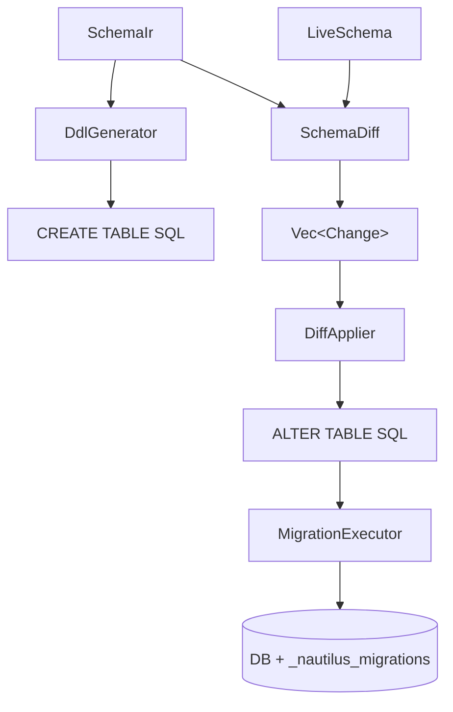

# nautilus-migrate

Schema migrations for Nautilus ORM — DDL generation, schema diffing, and migration execution.

---

## How migrations work

Nautilus-migrate supports two workflows that share the same underlying engine.

**`nautilus db push`** — computes the diff between the live database and your schema, then applies the changes immediately. No migration files are written. Good for development.

**`nautilus migrate generate` + `nautilus migrate apply`** — same diff, but writes versioned `.up.sql` / `.down.sql` files to disk first. You review and commit the files, then apply them. Good for production.

Both paths go through the same four stages:



---

### Stage 1 — DDL generation (initial migration)

Starting from the schema IR, `DdlGenerator` emits SQL to create every table from scratch. Models are topologically sorted so that tables with foreign keys are created after the tables they reference.

**Schema:**

```prisma
datasource db {
  provider            = "postgresql"
  url                 = env("DATABASE_URL")
  extensions          = [citext, hstore, vector]
  preserve_extensions = true
}

model User {
  id        Uuid     @id @default(uuid())
  email     String   @unique
  role      Role     @default(USER)
  createdAt DateTime @default(now()) @map("created_at")
  embedding Vector(1536)?
  posts     Post[]
  @@map("users")
}

model Post {
  id        BigInt         @id @default(autoincrement())
  userId    Uuid           @map("user_id")
  title     String
  rating    Decimal(10, 2)
  createdAt DateTime       @default(now()) @map("created_at")
  user      User           @relation(fields: [userId], references: [id], onDelete: Cascade)
  @@map("posts")
}

enum Role {
  USER
  ADMIN
}
```

**Generated DDL (PostgreSQL):**

```sql
-- 1. Extensions (Postgres-only, emitted before types and tables)
CREATE EXTENSION IF NOT EXISTS "citext";
CREATE EXTENSION IF NOT EXISTS "hstore";

-- 2. Enum type (Postgres-only - wrapped in DO block for idempotency)
DO $$ BEGIN
  CREATE TYPE "role" AS ENUM ('USER', 'ADMIN');
EXCEPTION WHEN duplicate_object THEN NULL;
END $$;

-- 3. users table (no FK dependencies - created first)
CREATE TABLE IF NOT EXISTS "users" (
  "id"         UUID                     NOT NULL DEFAULT gen_random_uuid(),
  "email"      TEXT                     NOT NULL,
  "role"       "role"                   NOT NULL DEFAULT 'USER',
  "created_at" TIMESTAMP WITH TIME ZONE NOT NULL DEFAULT CURRENT_TIMESTAMP,
  PRIMARY KEY ("id"),
  UNIQUE ("email")
);

-- 3. posts table (depends on users via FK — created after)
CREATE TABLE IF NOT EXISTS "posts" (
  "id"         BIGSERIAL,
  "user_id"    UUID                     NOT NULL,
  "title"      TEXT                     NOT NULL,
  "rating"     DECIMAL(10, 2)           NOT NULL,
  "created_at" TIMESTAMP WITH TIME ZONE NOT NULL DEFAULT CURRENT_TIMESTAMP,
  PRIMARY KEY ("id"),
  FOREIGN KEY ("user_id") REFERENCES "users" ("id") ON DELETE CASCADE
);
```

**Generated DDL (SQLite):**

```sql
-- No native enums — Role becomes TEXT
CREATE TABLE IF NOT EXISTS "users" (
  "id"         CHAR(36)  NOT NULL,
  "email"      TEXT      NOT NULL,
  "role"       TEXT      NOT NULL DEFAULT 'USER',
  "created_at" DATETIME  NOT NULL DEFAULT CURRENT_TIMESTAMP,
  PRIMARY KEY ("id"),
  UNIQUE ("email")
);

CREATE TABLE IF NOT EXISTS "posts" (
  "id"         INTEGER PRIMARY KEY AUTOINCREMENT,
  "user_id"    CHAR(36)      NOT NULL,
  "title"      TEXT          NOT NULL,
  "rating"     DECIMAL(10,2) NOT NULL,
  "created_at" DATETIME      NOT NULL DEFAULT CURRENT_TIMESTAMP,
  FOREIGN KEY ("user_id") REFERENCES "users" ("id") ON DELETE CASCADE
);
```

---

### Stage 2 — Live schema introspection

Before computing a diff, `SchemaInspector` queries the live database and builds a `LiveSchema` snapshot — a normalized in-memory representation of what is actually in the database right now.

For PostgreSQL it queries `information_schema`, `pg_catalog`, and
`pg_extension`; for SQLite it uses `PRAGMA table_info()` and
`PRAGMA index_list()`; for MySQL it queries `information_schema.columns` and
`information_schema.statistics`. PostgreSQL's built-in `plpgsql` extension is
excluded from snapshots because it is present by default and should not be
declared by users.

Every value in the snapshot is **normalized** (lower-cased, casts stripped, display widths removed) so that cosmetic differences — like `'USER'::text` vs `'USER'` — are ignored during comparison.

PostgreSQL extensions are treated declaratively. If the target datasource lists
an extension that is missing from the live database, the diff emits
`CreateExtension`. If the live database has an extension that is not listed in
the target datasource, the diff emits a destructive `DropExtension`. Drops are
generated without `CASCADE`, which lets PostgreSQL fail loudly when tables,
indexes, or types still depend on the extension. Set
`preserve_extensions = true` in the datasource to continue creating declared
missing extensions while ignoring extra live extensions that are managed by
another tool.

**Example snapshot** for a database that has `users` but is missing `posts`:

```
LiveSchema {
  tables: {
    "users": LiveTable {
      name:        "users",
      primary_key: ["id"],
      columns: [
        LiveColumn { name: "id",         col_type: "uuid",      nullable: false, default: "gen_random_uuid()" },
        LiveColumn { name: "email",      col_type: "text",      nullable: false, default: None },
        LiveColumn { name: "role",       col_type: "role",      nullable: false, default: "'USER'" },
        LiveColumn { name: "created_at", col_type: "timestamp", nullable: false, default: "CURRENT_TIMESTAMP" },
      ],
      indexes: [
        LiveIndex { columns: ["email"], unique: true },
      ],
    },
    // "posts" is absent — the table does not exist yet
  }
}
```

---

### Stage 3 — Schema diff

`SchemaDiff::compute(&live, &schema_ir, provider)` compares the live snapshot against the target `SchemaIr` and returns a `Vec<Change>`.

The diff runs in three passes:

**Pass 1 — New tables** (topo-sorted by FK dependency order):
For every model in the target that has no matching table in the live DB.

**Pass 2 — Dropped tables:**
For every table in the live DB that has no matching model in the target.

**Pass 3 — Per-table column and constraint diffs** (for tables that exist in both):
- **Added columns**: fields in the target model not present in the live table
- **Dropped columns**: columns in the live table not present in the target model
- **Type changes**: `gen.column_type_sql(field)` vs `live_col.col_type` after normalization
- **Nullability changes**: `field.is_required` vs `live_col.nullable`
- **Default changes**: normalized default expressions compared
- **Primary key changes**: sorted PK column sets compared
- **Index additions / drops**: target `@@index` and `@unique` sets vs live indexes

**Continuing the example** — the live DB has `users` but not `posts`, and `users` is missing the `role` column:

```
Vec<Change> [
  Change::NewTable(
    ModelIr { logical_name: "Post", db_name: "posts", ... }
  ),
  Change::AddedColumn {
    table: "users",
    field: FieldIr { logical_name: "role", db_name: "role", field_type: Enum("Role"), is_required: true, has_default: true },
  },
]
```

Each `Change` also carries a `ChangeRisk`:
- `Safe` — `NewTable`, `AddedColumn` (nullable or with default), `IndexAdded`
- `Destructive` — `DroppedTable`, `DroppedColumn`, `TypeChanged`, `NullabilityChanged`

---

### Stage 4 — SQL generation from diff

`DiffApplier::sql_for(change)` translates each `Change` into one or more SQL statements, using provider-specific syntax.

**`Change::NewTable`** -> full `CREATE TABLE` (same as initial DDL):

```sql
CREATE TABLE IF NOT EXISTS "posts" (
  "id"         BIGSERIAL,
  "user_id"    UUID                     NOT NULL,
  "title"      TEXT                     NOT NULL,
  "rating"     DECIMAL(10, 2)           NOT NULL,
  "created_at" TIMESTAMP WITH TIME ZONE NOT NULL DEFAULT CURRENT_TIMESTAMP,
  PRIMARY KEY ("id"),
  FOREIGN KEY ("user_id") REFERENCES "users" ("id") ON DELETE CASCADE
);
```

**`Change::AddedColumn`** -> `ALTER TABLE ... ADD COLUMN`:

```sql
ALTER TABLE "users" ADD COLUMN "role" "role" NOT NULL DEFAULT 'USER';
```

**`Change::DroppedColumn`** (Postgres/MySQL) -> `ALTER TABLE ... DROP COLUMN`:

```sql
ALTER TABLE "users" DROP COLUMN "rating";
```

**`Change::TypeChanged`** (Postgres) -> `ALTER TABLE ... ALTER COLUMN ... TYPE`:

```sql
ALTER TABLE "users" ALTER COLUMN "rating" TYPE NUMERIC(12, 4);
```

**`Change::NullabilityChanged`** (Postgres, making a column NOT NULL) -> three statements:

```sql
ALTER TABLE "users" ALTER COLUMN "rating" SET DEFAULT 0;
UPDATE "users" SET "rating" = 0 WHERE "rating" IS NULL;
ALTER TABLE "users" ALTER COLUMN "rating" SET NOT NULL;
```

**`Change::IndexAdded`** -> `CREATE [UNIQUE] INDEX`:

```sql
CREATE INDEX "users_role_idx" ON "users" ("role");
```

> SQLite does not support `ALTER TABLE ... DROP COLUMN` or `ALTER TABLE ... ALTER COLUMN TYPE`. For those cases `DiffApplier` falls back to a five-step table rebuild: create a temp table, copy data, drop the original, rename the temp.

---

### Migration files

When using the versioned workflow (`nautilus migrate generate`), the diff SQL is written to disk as a pair of files:

```
migrations/
  20260301120000_add_posts/
    up.sql
    down.sql
```

**`up.sql`** — applies the change:

```sql
CREATE TABLE IF NOT EXISTS "posts" (
  "id"         BIGSERIAL,
  "user_id"    UUID           NOT NULL,
  "title"      TEXT           NOT NULL,
  "rating"     DECIMAL(10, 2) NOT NULL,
  "created_at" TIMESTAMP WITH TIME ZONE NOT NULL DEFAULT CURRENT_TIMESTAMP,
  PRIMARY KEY ("id"),
  FOREIGN KEY ("user_id") REFERENCES "users" ("id") ON DELETE CASCADE
);

ALTER TABLE "users" ADD COLUMN "role" "role" NOT NULL DEFAULT 'USER';
```

**`down.sql`** — best-effort reversal (auto-generated):

```sql
DROP TABLE IF EXISTS "posts";

ALTER TABLE "users" DROP COLUMN "role";
```

Statements are separated by a blank line and terminated with `;`. The down file may contain `-- Cannot auto-reverse` comments for changes that cannot be safely reversed (e.g., type changes on MySQL, column drops on SQLite).

Migration directories are sorted lexicographically — the timestamp prefix guarantees chronological order.

---

### Migration tracking

When a migration is applied, `MigrationExecutor` wraps all its statements in a **single transaction** and records the result in the `_nautilus_migrations` tracking table:

```sql
CREATE TABLE IF NOT EXISTS _nautilus_migrations (
  id               SERIAL PRIMARY KEY,
  name             TEXT   NOT NULL UNIQUE,
  checksum         TEXT   NOT NULL,       -- SHA-256 of up + down SQL
  applied_at       TEXT   NOT NULL,       -- RFC 3339 timestamp
  execution_time_ms BIGINT NOT NULL
);
```

After applying the example migration above the table contains:

```
 id │ name                      │ checksum   │ applied_at               │ execution_time_ms
────┼───────────────────────────┼────────────┼──────────────────────────┼──────────────────
  1 │ 20260301120000_add_posts   │ a3f9bc...  │ 2026-03-01T12:00:05Z     │ 42
```

On subsequent runs `MigrationTracker::is_applied(name)` checks this table. If the recorded checksum does not match the file on disk, Nautilus raises a `ChecksumMismatch` error before running anything.

---

## `db push` vs `migrate generate` + `migrate apply`

| | `db push` | `migrate generate` + `migrate apply` |
|---|---|---|
| Writes migration files | No | Yes |
| Immediately modifies the DB | Yes | Only after explicit `apply` |
| Good for | Local development | CI / production |
| Rollback support | No (no down file) | Yes (via down.sql) |
| Audit trail | No | Yes (files can be committed to git) |

Both paths call the same `SchemaDiff::compute` + `DiffApplier::sql_for` logic internally.

---

## CLI reference

```bash
# Apply diff directly to the DB (no files written)
nautilus db push

# Generate versioned migration files from current diff
nautilus migrate generate <label> [--schema schema.nautilus]

# Show applied / pending status of all migration files
nautilus migrate status

# Apply all pending migrations in order
nautilus migrate apply

# Roll back the last applied migration
nautilus migrate rollback

# Roll back the last N migrations
nautilus migrate rollback --steps 3
```

---

## Rollback coverage

| Change | PostgreSQL | MySQL | SQLite | Notes |
|---|:---:|:---:|:---:|---|
| **Create table** (`NewTable`) | ✅ | ✅ | ✅ | `DROP TABLE IF EXISTS` |
| **Drop table** (`DroppedTable`) | ✅ | ✅ | ✅ | `CREATE TABLE` reconstructed from live snapshot |
| **Add column** (`AddedColumn`) | ✅ | ✅ | ❌ | `ALTER TABLE … DROP COLUMN`; not supported on all SQLite versions |
| **Drop column** (`DroppedColumn`) | ✅ | ✅ | ❌ | `ALTER TABLE … ADD COLUMN` reconstructed from live snapshot |
| **Type change** (`TypeChanged`) | ✅ | ❌ | ❌ | Postgres: `ALTER COLUMN … TYPE <old_type>`; others require a full column rebuild |
| **Nullability change** (`NullabilityChanged`) | ✅ | ❌ | ❌ | Postgres: `SET / DROP NOT NULL` |
| **Default change** (`DefaultChanged`) | ✅ | ❌ | ❌ | Postgres: `SET DEFAULT / DROP DEFAULT` |
| **Primary key change** (`PrimaryKeyChanged`) | ✅ | ✅ | ❌ | Reconstructs old PK from live snapshot |
| **Add index** (`IndexAdded`) | ✅ | ✅ | ✅ | `DROP INDEX IF EXISTS` |
| **Drop index** (`IndexDropped`) | ✅ | ✅ | ✅ | `CREATE [UNIQUE] INDEX` reconstructed from live snapshot |

Changes marked ❌ emit a `-- Cannot auto-reverse` comment in the down file so you can identify exactly what needs to be filled in manually.

---

## Architecture

```
nautilus-migrate
├── ddl.rs        # SchemaIr -> CREATE/DROP TABLE SQL + type/default mapping
├── diff.rs       # LiveSchema vs SchemaIr -> Vec<Change> + topo-sort
├── applier.rs    # Change -> provider-specific SQL statements
├── inspector.rs  # Live-schema introspection (Postgres / SQLite / MySQL)
├── live.rs       # LiveSchema / LiveTable / LiveColumn snapshot types
├── executor.rs   # Apply / rollback / diff-based migration generation
├── file_store.rs # Migration file I/O (.up.sql / .down.sql pairs)
├── tracker.rs    # _nautilus_migrations tracking table
├── migration.rs  # Migration struct, SHA-256 checksum, status types
├── serializer.rs # db-pull serialiser (LiveSchema -> .nautilus source)
└── error.rs      # MigrationError enum
```
